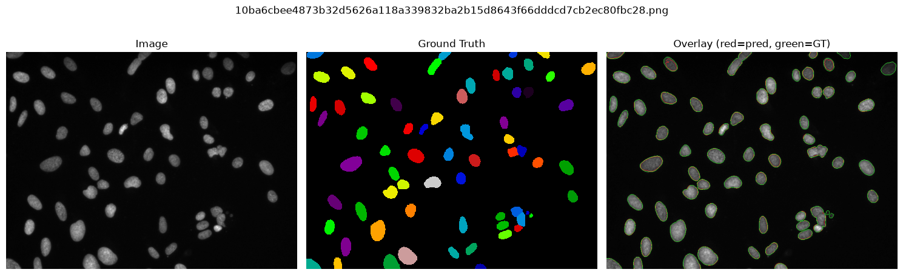
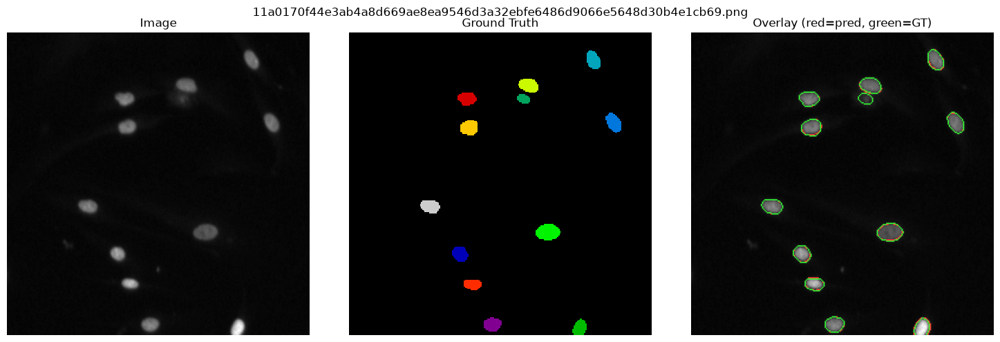
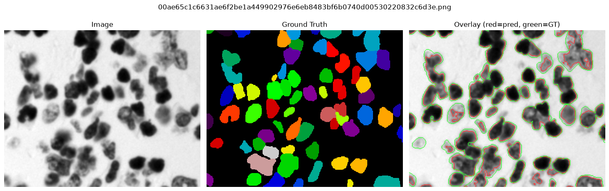

# Bioimage QC Agent

## Overview

Bioimage QC Agent is a microscopy image segmentation and quality-control pipeline. It supports classical watershed segmentation, Cellpose deep learning, and the Segment Anything Model (SAM / micro-SAM). A rule-based agent detects segmentation failures and recommends parameter corrections. A ViT-based QC classifier provides a learned alternative to rule-based image quality assessment.


Bioimage analysis workflows require reliable segmentation, benchmarking, quality control, annotation comparison, and reproducible reporting. This project demonstrates a practical observe-decide-act-evaluate loop for segmentation QC.


## Interactive Web App


A live demo is available via Streamlit Cloud. Click the badge below to open it in your browser — no installation required.

[](https://bioimage-qc.streamlit.app/)
Dashboard link:
```text
https://bioimage-qc.streamlit.app/
```
The app lets you:

- **Upload** any PNG/TIF fluorescence or brightfield image (or pick from the built-in sample gallery)
- **Tune** watershed parameters interactively — smoothing σ, min object size, peak distance
- **See** the raw image, colour-coded segmentation, overlay, and nucleus size histogram side by side
- **Inspect** rule-based QC flags (blur, contrast, tiny-object fraction)
- **Watch** the agent detect over/under-segmentation and automatically re-run with corrected parameters
- **Download** the overlay PNG, predicted mask, and a metrics CSV

To run the app locally:

```bash
streamlit run streamlit_app.py
```

For a minimal install (no Cellpose / SAM / torch needed):

```bash
pip install -r requirements-cloud.txt
streamlit run streamlit_app.py
```


## Dataset

Designed for the **BBBC038 / 2018 Data Science Bowl** nuclei segmentation dataset (Kaggle). Download and convert ~50 images with:

```bash
# Download from Kaggle
kaggle competitions download -c data-science-bowl-2018 -p data/raw/

# Unzip
unzip data/raw/data-science-bowl-2018.zip -d data/raw/

# Convert instance masks to labeled masks (50-image subset)
python src/data_utils.py \
  --input data/raw/stage1_train \
  --output data/bbbc038_subset \
  --limit 50
```

Expected structure after conversion:

```
data/bbbc038_subset/
├── images/   ← one PNG per sample
└── masks/    ← one labeled PNG per sample
```

## Methods

### Segmentation

| Method | Module | Install | Mean Dice* |
|--------|--------|---------|-----------|
| **Watershed** | `src/segment_watershed.py` | *(built-in, no extras)* | 0.380 |
| **Cellpose** | `src/segment_cellpose.py` | `pip install cellpose` | **0.888** |
| **SAM vit_b** | `src/segment_sam.py` | `pip install segment-anything` + checkpoint | 0.251 |
| **micro-SAM vit_b_lm** | `src/segment_sam.py` | `pip install micro-sam` | 0.089† |

*Dice averaged over 5 BBBC038 fluorescence nuclei images.  
†micro-SAM in automatic mask generation (AMG) mode; designed primarily for interactive annotation.

**Watershed** — Otsu threshold + distance transform + watershed.  No training, fully classical.

**Cellpose** — Deep-learning flow field model.  `nuclei` model targets DAPI/GFP nuclei;
`cyto`/`cyto2` models target whole cells.  GPU optional.

**SAM** (Segment Anything Model) — Meta's promptable segmentation model.  Used in
*automatic mask generation* mode: a regular grid of point prompts discovers every
nucleus without manual annotation.  Requires a `.pth` checkpoint:

```bash
wget https://dl.fbaipublicfiles.com/segment_anything/sam_vit_b_01ec64.pth
```

**micro-SAM** — SAM fine-tuned on fluorescence and electron microscopy images.
Checkpoints download automatically on first use.  Recommended for dense nuclei.

### QC

| Method | Module | Notes |
|--------|--------|-------|
| Blur score | `src/qc.py` | Laplacian variance |
| Contrast score | `src/qc.py` | Pixel std dev |
| Tiny object fraction | `src/qc.py` | Fraction of objects < 20 px |
| **ViT QC classifier** | `src/vit_qc.py` | ViT-B/16 features + logistic regression |

**ViT QC Classifier** — A frozen ViT-B/16 backbone (ImageNet pretrained) extracts
768-d visual embeddings.  A logistic regression head (sklearn) is trained with
rule-based pseudo-labels so no manually annotated QC dataset is required.
Falls back to HOG features when `torch` is not installed.

Other evaluation:
- Dice and IoU vs ground truth
- Object count error
- Rule-based agentic QC with automatic parameter correction
- Optional LLM explanation layer (template / Ollama / Gemini)

## What Is the Agent?

The Segmentation QC Agent follows an observe → decide → act → evaluate loop.

It observes Dice, IoU, predicted vs. ground truth object counts, blur score, contrast, and tiny object fraction. It detects over-segmentation, under-segmentation, low contrast, and blur — then recommends new parameters and optionally reruns segmentation, keeping the better result.

## Results & Examples

Pipeline run on 50 BBBC038 fluorescence nuclei images (watershed method, `--auto-rerun`).

| Metric | Value |
|--------|-------|
| Mean Dice (best result per image) | **0.648** |
| Images with Dice > 0.80 | **26 / 50 (52%)** |
| Agent triggered rerun on failures | automatic |
| Avg runtime per image | ~20 ms |

Each overlay shows: **raw image** → **ground truth** → **prediction overlay** (red = predicted contours, green = ground truth).

---

**High-density nuclei — Dice 0.95, IoU 0.91 (67 nuclei)**



Watershed cleanly separates tightly packed nuclei. Predicted count: 59, ground truth: 67. Agent status: ✓ pass.

---

**Sparse nuclei — Dice 0.94, IoU 0.89 (12 nuclei)**



Near-perfect boundary alignment on isolated nuclei. Predicted count: 11, ground truth: 12. Agent status: ✓ pass.

---

**Agent-flagged failure — Dice 0.11, under-segmentation detected**



Predicted count: 1, ground truth: 70. Agent detected under-segmentation, triggered a parameter-adjusted rerun (σ reduced, min-size halved), and flagged for manual review. This demonstrates the observe→decide→act loop on a hard brightfield sample.

---

## Installation

```bash
module load mamba/latest
source activate bmi-cv
pip install -r requirements.txt

# Optional — install what you need:
pip install scikit-learn                # ViT QC classifier (HOG backend, always works)
pip install torch torchvision          # ViT QC classifier (ViT backend, recommended)
pip install cellpose                   # Cellpose segmentation
pip install segment-anything           # SAM segmentation
pip install micro-sam                  # micro-SAM segmentation
```

## Run Pipeline

```bash
# Watershed (default)
python src/run_pipeline.py \
  --image-dir data/bbbc038_subset/images \
  --mask-dir data/bbbc038_subset/masks \
  --output-dir results \
  --auto-rerun

# Cellpose
python src/run_pipeline.py \
  --image-dir data/bbbc038_subset/images \
  --mask-dir data/bbbc038_subset/masks \
  --output-dir results_cellpose \
  --method cellpose

# SAM (vit_b)
python src/run_pipeline.py \
  --image-dir data/bbbc038_subset/images \
  --mask-dir data/bbbc038_subset/masks \
  --output-dir results_sam \
  --method sam \
  --sam-checkpoint sam_vit_b_01ec64.pth

# micro-SAM
python src/run_pipeline.py \
  --image-dir data/bbbc038_subset/images \
  --output-dir results_microsam \
  --method microsam \
  --sam-model-type vit_b_lm

# With ViT QC classifier
python src/run_pipeline.py \
  --image-dir data/bbbc038_subset/images \
  --mask-dir data/bbbc038_subset/masks \
  --output-dir results \
  --vit-qc \
  --vit-qc-model results/vit_qc_clf.pkl
```

Run without ground truth masks:

```bash
python src/run_pipeline.py \
  --image-dir data/bbbc038_subset/images \
  --output-dir results
```

## Run Dashboard

```bash
streamlit run app.py
```

The dashboard sidebar lets you choose the segmentation method and enable the ViT QC classifier. The results panel shows rule-based QC and ViT QC side by side.

## Generate HTML Report

```bash
python make_dashboard.py
# → results/dashboard.html
```

## Run Tests

```bash
pytest tests/
```

## Outputs

| File | Description |
|------|-------------|
| `results/masks/` | Predicted labeled masks |
| `results/overlays/` | Side-by-side overlay PNGs |
| `results/metrics.csv` | Per-image Dice, IoU, object counts, runtime, ViT QC |
| `results/qc_report.csv` | Per-image blur, contrast, tiny-object QC |
| `results/agent_report.md` | Human-readable agent decisions and explanations |
| `results/dashboard.html` | Interactive Plotly dashboard |
| `results/vit_qc_clf.pkl` | Saved ViT QC classifier (created by `--vit-qc`) |

## Optional LLM Explanation

The project works without any LLM API key. To enable richer explanations:

```bash
# Local Ollama
ollama pull qwen2.5:3b
python src/run_pipeline.py ... --llm-provider ollama

# Gemini
export GEMINI_API_KEY="your_key"
python src/run_pipeline.py ... --llm-provider gemini
```

## Future Extensions

- OME-Zarr support
- napari viewer plugin
- Large-image tiled processing
